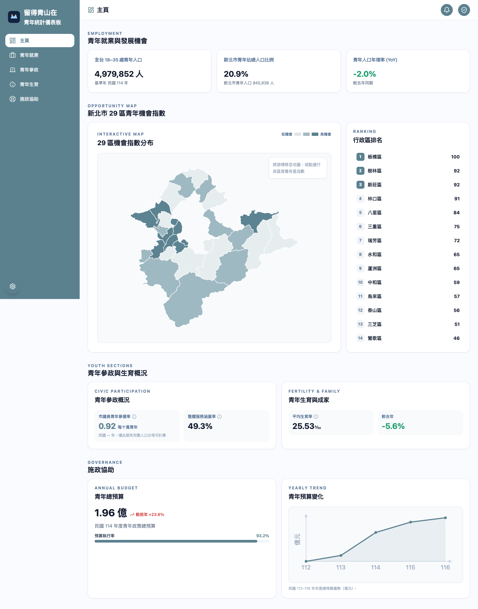
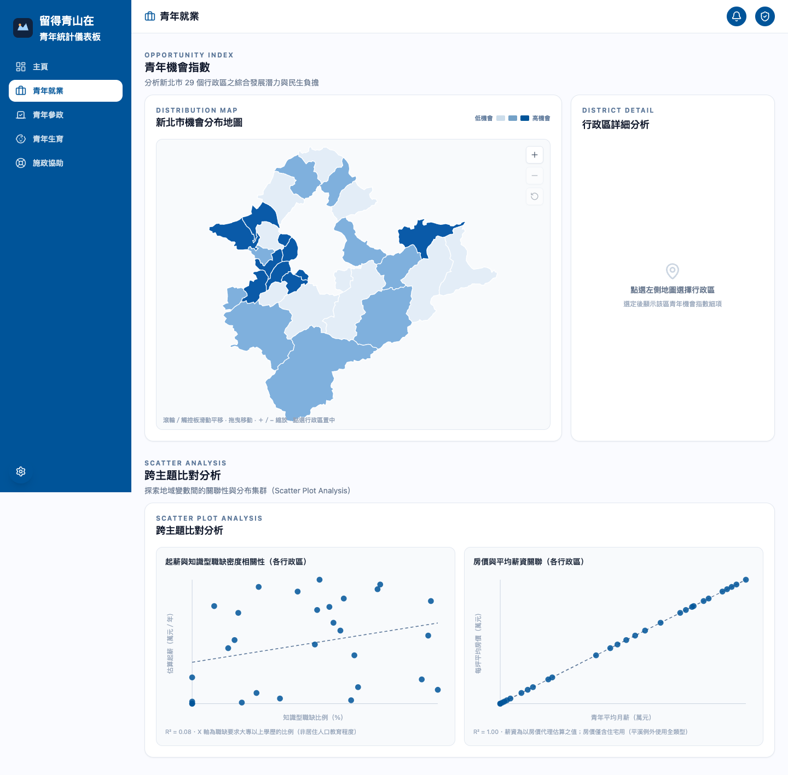
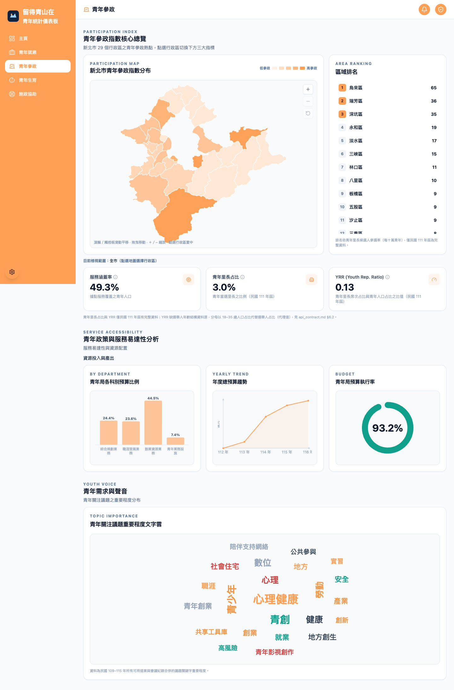
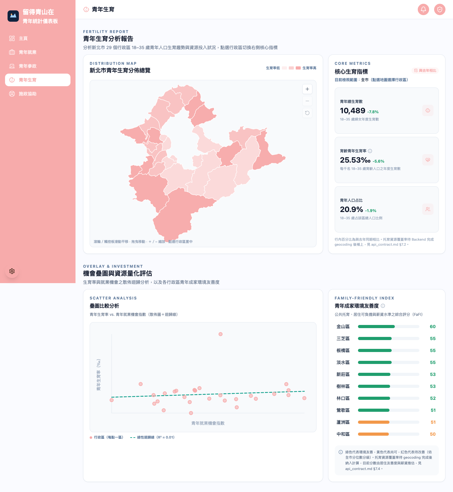
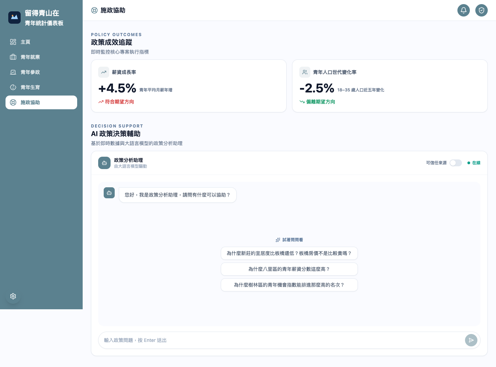
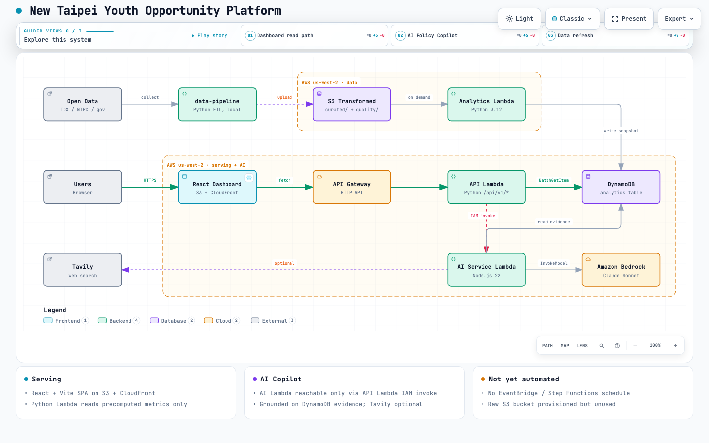

# 留得青山在｜新北青年機會與留才風險地圖

**New Taipei Youth Opportunity & Retention Platform**

## Project Overview

本專案聚焦新北市 29 個行政區與 18–35 歲青年，整合跨部會、新北市政府及青年局公開資料，觀察各區的青年發展機會、人口變化、留才風險與資源配置情形。

目標不只呈現統計數字，而是協助使用者理解青年需求與政府資源供給之間的關係，並以 AI 提供可追溯資料依據的政策分析輔助。

## Frontend Preview

<table>
  <tr>
    <td align="center">
      <a href="docs/frontend/home.png"></a><br>
      <sub>首頁</sub>
    </td>
  </tr>
  <tr>
    <td align="center">
      <a href="docs/frontend/employment.png"></a><br>
      <sub>青年就業</sub>
    </td>
  </tr>
  <tr>
    <td align="center">
      <a href="docs/frontend/politics.png"></a><br>
      <sub>青年參政</sub>
    </td>
  </tr>
  <tr>
    <td align="center">
      <a href="docs/frontend/fertility.png"></a><br>
      <sub>青年生育</sub>
    </td>
  </tr>
  <tr>
    <td align="center">
      <a href="docs/frontend/policy-support.png"></a><br>
      <sub>施政協助</sub>
    </td>
  </tr>
</table>

## Key Features

- **29 District Youth Map**：以 29 區地圖作為主要入口，呈現行政區層級的青年資料。（前端已建置：首頁、就業、參政、生育、施政協助共 5 個頁面，見 `frontend/src/features/`）
- **Youth Opportunity Index**：綜合工作、薪資、人才發展、居住負擔與交通可及性，比較青年發展環境。（UI 已建置；正式資料待 data-pipeline 把 published snapshot 寫進 DynamoDB）
- **Cohort Retention Signal**：觀察青年人口趨勢與留才風險訊號。（各區 `retentionRiskLevel` 已在資料模型中；分年齡層級的趨勢尚未實作）
- **Talent / Job Analysis**：分析職缺需求、職群、薪資、職業訓練與人才培育趨勢。（UI 已建置；部分底層分析——如跨主題散佈圖的迴歸線——仍未完成，見 `api_contract.md`）
- **Youth Resource Gap**：比較青年需求與青年局／政府資源供給，辨識高需求低供給區域。（UI 已建置；部分資料源尚未確認，見 `api_contract.md` §6.3）
- **AI Policy Copilot**：根據已計算的指標與資料證據，整理問題、優勢、缺口與可能政策方向。（前端已有對話 UI，目前回覆為固定訊息；`ai-service/` 的 Bedrock 整合尚未接上前端或部署）
- **Data Explanation**：將圖表與統計結果轉換為一般使用者容易理解的文字說明。（規劃中，同上）

職缺與畢業生資料的母體及時間尺度不同，不直接以「職缺數 - 畢業生數」定義人才缺口；相關分析應採用標準化指標與趨勢呈現。

## System Architecture

以下為目標架構；標示 [已部署] 的部分已用 Terraform 部署到 AWS，其餘仍在規劃：

[](docs/architecture/system-architecture.html)

互動式版本：[system-architecture.html](docs/architecture/system-architecture.html)；相關圖檔與驗證輸出見 [`docs/architecture/`](docs/architecture/)。

## Project Structure

```text
newtaipei-youth/
├── frontend/           # React + Vite 地圖與 Dashboard 前端（已建置部署到 S3 + CloudFront）
│   ├── public/         # 前端公開資產，目前包含新北市地圖資料
│   ├── src/
│   └── package.json
├── backend/            # TypeScript + Node.js REST API 邊界（尚為 scaffold，未實作；
│   ├── src/            # 正式環境的讀取 API 目前是 infrastructure/modules/api/ 的 Python Lambda）
│   ├── tests/
│   └── package.json
├── ai-service/         # Amazon Bedrock／AI 回覆
│   ├── tests/
│   └── package.json
├── data-pipeline/      # Python ETL、資料分析與指標計算
│   ├── src/
│   ├── config/
│   ├── data/           # collector/analytics 輸出與 published snapshot
│   ├── tests/
│   ├── requirements.txt
│   └── Dockerfile
├── shared/              # 前端、Backend、AI 共用 TypeScript Types（已有實作）
│   ├── src/
│   └── package.json
├── infrastructure/     # Terraform Infrastructure as Code（實際部署工具；CDK 為未使用的舊 placeholder）
│   ├── main.tf / variables.tf / outputs.tf / versions.tf
│   ├── modules/        # frontend、api、analytics_table、raw_data、transformed_data
│   ├── scripts/        # seed_test_data.py：本地灌測試資料到 DynamoDB
│   ├── dynamodb_schema.md
│   ├── infrastructure.md
│   ├── cdk.json / bin/ / lib/   # 未使用的舊 placeholder
│   └── package.json
├── docs/                # 架構與技術文件
├── README.md
└── DESIGN_LANGUAGE.md
```

## Data Pipeline

資料管線的目標流程為：

```text
公開資料
  ↓
S3 Raw Data
  ↓
ETL / 清理 / 對齊行政區與期間
  ↓
Deterministic Analytics
  ↓
指標與來源證據
  ↓
DynamoDB / AI Context
```

人口、職缺、人才培育、居住、交通與青年資源資料應保留資料期間、來源與更新時間。青年人口 YoY、Youth Opportunity Index、Cohort Retention Signal、Youth Resource Gap 與 Retention Risk 等指標應由資料分析程式計算，而不是交由 LLM 推算。

`data-pipeline/` 已實作 collector、ETL 與 analytics 計算（`run_pipeline.py`、`run_analytics.py`），可產生 published snapshot（見 `intro_pipeline.md`）；DynamoDB schema 已設計（`infrastructure/dynamodb_schema.md`），但尚未有自動把 snapshot 寫進 DynamoDB 的排程或雲端資源。

## AI Architecture

AI Service 預計使用 Amazon Bedrock，透過已整理的 AI Context / Evidence 進行 Grounded Generation。LLM 的責任是解釋、摘要、語意理解與提出政策方向，不負責計算核心指標。

AI 回覆應盡可能符合以下原則：

- 使用 Structured Output，讓問題辨識、發展優勢、資源缺口、政策方向、判斷依據與資料限制可分開呈現。
- 提供 Evidence / Source reference，避免捏造數字或資料來源。
- 資料不足時明確標示限制。
- AI 建議屬於政策輔助資訊，不代表政府正式政策決定。

`ai-service/` 已實作 Bedrock client、context/evidence 組裝與 Structured Output 驗證（見 `ai-service/ai-service.md`），但尚未部署成雲端 Lambda；RAG／Knowledge Base 仍未實作。

## Tech Stack

| Layer          | Technology                                                                              | Status                                                               |
| -------------- | --------------------------------------------------------------------------------------- | -------------------------------------------------------------------- |
| Frontend       | React, Vite, D3 Geo, TopoJSON                                                           | 已部署（S3 + CloudFront）                                            |
| API            | Python（`infrastructure/modules/api/lambda/handler.py`）+ Amazon API Gateway (HTTP API) | 已部署，讀取 DynamoDB（表目前是空的）                                |
| Backend        | TypeScript, Node.js（`backend/`）                                                       | Scaffold / planned，未實際使用——正式 API 由上面的 Python Lambda 提供 |
| AI             | Amazon Bedrock, RAG / Knowledge Base                                                    | 程式碼已實作（`ai-service/`），尚未部署雲端資源                      |
| Data           | Python, Pandas / GeoPandas（`data-pipeline/`）                                          | 已實作 ETL 與 analytics，尚未部署為雲端排程                          |
| Storage        | Amazon S3（raw / transformed / frontend）, DynamoDB                                     | 已部署                                                               |
| Workflow       | EventBridge, Step Functions                                                             | Architecture / planned                                               |
| Infrastructure | **Terraform**（`infrastructure/`）                                                      | 使用中；`AWS CDK`（`cdk.json`/`bin`/`lib`）為未使用的舊 placeholder  |

## Development Status

本專案目前處於新北市 AI Hackathon 開發階段。前端（含簡報頁）、讀取 API（Python Lambda + API Gateway）、DynamoDB 與相關 S3 bucket 已用 Terraform 部署到 AWS；DynamoDB 目前是空的，待 data-pipeline 的 loader 把 published snapshot 寫入後，API 才會回傳真實資料而不是 503。data-pipeline 與 ai-service 都已有實質程式碼但尚未部署雲端資源；backend/（TypeScript）仍是空的 scaffold，未被使用。
