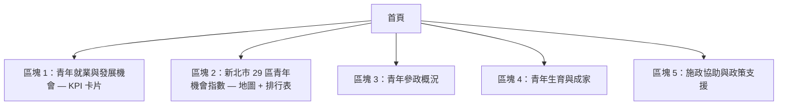

# 主頁（首頁）參數分析、指數公式設計與資料源對應

> 本文件針對首頁 preview 中所有可視元素，逐一拆解其所需參數、計算公式、以及對應的資料源編號。

---

## 一、主頁版面結構與所有參數清單

根據 [主頁 preview](file:///c:/Users/m2006/Desktop/新北黑克松/page_preview/1. 主頁.png)，首頁分為 **5 大區塊**：



### 區塊 1：青年就業與發展機會 — 頂部 KPI 卡片（3 張）

| # | 顯示項目 | 範例值 | 說明 |
|---|--------|-------|------|
| 1-1 | **全台 18–35 歲青年人口** | 5,231k | 全國青年人口總數 |
| 1-2 | 較去年變動率 | ↓ -1.2% vs 去年 | YoY 變動 |
| 1-3 | **青年占總人口比例** | 22.4% | 新北市青年人口 ÷ 新北市總人口 |
| 1-4 | 較去年變動 | ↓ -0.4% vs 去年 | YoY 變動 |
| 1-5 | **青年人口年增率** | -1.2% | 新北市 18–35 青年 YoY |
| 1-6 | 趨勢附註 | 長期微幅下降趨勢 | 趨勢判斷文字 |

---

### 區塊 2：新北市 29 區青年機會指數 — 地圖 + 排行表

| # | 顯示項目 | 範例值 | 說明 |
|---|--------|-------|------|
| 2-1 | **29 區分層設色地圖** | — | 以「青年機會指數」著色，機會低→高（淺→深） |
| 2-2 | 地圖 Tooltip：行政區名 | 板橋區（核心區） | 滑鼠 hover 時顯示 |
| 2-3 | 地圖 Tooltip：機會指數 | 機會指數: 78（穩定） | 含等級判斷文字 |
| 2-4 | 地圖 Tooltip：各區小指標 | 1,250+/月 職缺、29 個軌道站點 | 快速預覽 |
| 2-5 | 切換按鈕：密度 / 趨勢 | — | 地圖可在「密度檢視」和「趨勢檢視」間切換 |
| 2-6 | **重點行政區分析表** | — | 右側表格 |
| 2-7 | 表格欄位：行政區 | 三重區 | — |
| 2-8 | 表格欄位：機會指數 | 86 | 青年機會指數 (0–100) |
| 2-9 | 表格欄位：年增率 | +2.1% | 青年人口 YoY |
| 2-10 | 表格欄位：留才風險 | 低 / 中 / 高 | AI 綜合判定 |
| 2-11 | 圖例 | 機會低 ← → 機會高 | 色階圖例 |

---

### 區塊 3：青年參政概況

| # | 顯示項目 | 範例值 | 說明 |
|---|--------|-------|------|
| 3-1 | **青年參選密度** | 12.8% | 20–35 歲候選人比例 |
| 3-2 | 較去年變動 | ↑ +1.5% | YoY |
| 3-3 | **各區參政強度分佈地圖** | — | 氣泡圖 / 散點圖，顯示各區參政強度 |
| 3-4 | 「查看各區詳細數據」按鈕 | — | 導向青年參政頁 |

---

### 區塊 4：青年生育與成家

| # | 顯示項目 | 範例值 | 說明 |
|---|--------|-------|------|
| 4-1 | **總生育率 vs 平均生育率 地圖** | — | 分層設色圖 |
| 4-2 | 「疊加機會指數」按鈕 | — | 可疊加青年機會指數做比較 |
| 4-3 | **市府資源分布評分** | 78.5 | 各區青年生育相關資源的綜合評分 |
| 4-4 | **生育補助涵蓋率** | 92% | 有生育補助的區占比，或青年可獲得補助的比例 |
| 4-5 | **AI 數據分析洞察** | 文字段落 | AI 分析生育率與公共資源密度的相關性 |

---

### 區塊 5：施政協助與政策支援

| # | 顯示項目 | 範例值 | 說明 |
|---|--------|-------|------|
| 5-1 | **政策成效追蹤** | — | 卡片標題 |
| 5-2 | 追蹤政策名稱 | 青年租金補貼專案 | 被追蹤的代表性政策 |
| 5-3 | 執行狀態標籤 | 執行中 | Badge |
| 5-4 | **預算執行率** | 85% | 進度條 |
| 5-5 | **目標達成率** | 92% | 進度條 |
| 5-6 | 「查看詳細報表」按鈕 | — | 導向施政協助頁 |
| 5-7 | **AI 政策輔助** | — | 右側卡片 |
| 5-8 | AI 輸入框 placeholder | 例如：請評估在三重區增加青年創業基地的可行性… | 使用者輸入 prompt |

---

## 二、專有指數公式設計

### 指數 A：青年機會指數 Youth Opportunity Index（YOI）

> 範圍 **0–100**，由 5 個面向子指數加權合成。此指數用於主頁地圖著色及排行表。

#### 架構

```
YOI = w₁·S_job + w₂·S_salary + w₃·S_talent + w₄·S_housing + w₅·S_transport
```

其中 `w₁ + w₂ + w₃ + w₄ + w₅ = 1`

**建議權重**（可由使用者調整）：

| 面向 | 代號 | 建議權重 | 理由 |
|------|------|---------|------|
| 工作機會 | S_job | 0.25 | 就業機會是青年留才最核心的驅力 |
| 薪資水準 | S_salary | 0.25 | 薪資與工作機會同等重要 |
| 人才發展 | S_talent | 0.15 | 教育與培訓是長期發展基礎 |
| 居住負擔 | S_housing | 0.20 | 居住成本是青年生活壓力的關鍵因素 |
| 交通可及 | S_transport | 0.15 | 通勤便利性影響就業範圍 |

#### 子指數 S₁：工作機會（S_job）— 範圍 0–100

```
S_job = 0.50 × norm(每萬名青年職缺數)
      + 0.30 × norm(職業多樣性_Shannon)
      + 0.20 × norm(人才需求趨勢_YoY成長率)
```

**各元素計算方式**：

| 元素 | 公式 | 資料源 |
|------|------|--------|
| 每萬名青年職缺數 | (該區職缺總數 ÷ 該區 18–35 人口) × 10,000 | **C1.1**（台灣就業通職缺 by zipno）÷ **A1** |
| 職業多樣性 (Shannon Index) | H = −Σ pᵢ ln(pᵢ)，pᵢ = 該區第 i 類職業的職缺占比 | **C1.2**（職缺 CJOB_NAME1/CJOB_NAME2） |
| 人才需求趨勢 | (本年度求才人數 − 上年度求才人數) ÷ 上年度求才人數 × 100% | **C1.3**（勞動部求才僱用人數） |

#### 子指數 S₂：薪資水準（S_salary）— 範圍 0–100

```
S_salary = 0.40 × norm(職缺刊登薪資中位數)
         + 0.30 × norm(高薪職缺比例)
         + 0.30 × norm(青年薪資_縣市級)
```

| 元素 | 公式 | 資料源 |
|------|------|--------|
| 職缺刊登薪資中位數 | 各區所有職缺 (NT_L + NT_U)/2 的中位數 | **C2.2** |
| 高薪職缺比例 | 該區刊登薪資 > 全市中位數 × 1.5 的職缺數 ÷ 該區總職缺數 | **C2.3**（衍生自 C2.2） |
| 青年薪資 | 主計總處受僱員工 25–29 歲年薪（縣市級，各區共用新北市數值） | **C2.1** |

#### 子指數 S₃：人才發展（S_talent）— 範圍 0–100

> [!WARNING]
> MD 檔備註指出：教育部資料是「學校所在地」非「青年居住地」，大專校院集中在淡水、新莊、三峽、板橋等少數幾區，其餘區會是 0。建議此面向**降至縣市級**或改成跨區可及的職訓資源。下方公式以「可及職訓資源」為主、教育資源為輔。

```
S_talent = 0.30 × norm(區內及鄰區大專學生數密度)
         + 0.35 × norm(職訓課程數)
         + 0.35 × norm(訓練人次_每萬青年)
```

| 元素 | 公式 | 資料源 |
|------|------|--------|
| 大專學生數密度 | 該區大專在校學生數 ÷ 該區面積 (km²) | **C3.1** + **A4** |
| 職訓課程數 | 該區（依辦訓地址地理編碼）的職訓課程數 | **C3.3** |
| 訓練人次 per 萬青年 | (區內訓練人次 ÷ 區 18–35 人口) × 10,000 | **C3.4** ÷ **A1** |

> [!NOTE]
> 若 C3.3/C3.4 無法精確到區級，可先用新北市整體數值等分，或以「該區到最近職訓據點的距離反比」做加權。

#### 子指數 S₄：居住負擔（S_housing）— 範圍 0–100（**反向指標**）

> 居住負擔越重 → 分數越低。因此在 norm 時做反轉：`norm_inv(x) = 1 − norm(x)`

```
S_housing = 0.35 × norm_inv(租金中位數)
          + 0.35 × norm_inv(房價中位數_per_m²)
          + 0.30 × norm_inv(租金薪資比)
```

| 元素 | 公式 | 資料源 |
|------|------|--------|
| 租金中位數 | 該區當期不動產租賃實價登錄中位數 | **C4.1** |
| 房價中位數 per m² | 該區不動產買賣實價登錄 ÷ 坪數 → 轉 m² | **C4.2** |
| 租金薪資比 | 月租金中位數 ÷ 該區職缺薪資中位數（C2.2） | **C4.3** = **C4.1** ÷ **C2.2** |

#### 子指數 S₅：交通可及（S_transport）— 範圍 0–100

```
S_transport = 0.35 × norm(每萬青年公車站數)
            + 0.40 × norm(軌道站點密度)
            + 0.25 × norm(公共自行車站點密度)
```

| 元素 | 公式 | 資料源 |
|------|------|--------|
| 每萬青年公車站數 | (區內公車站數 ÷ 區 18–35 人口) × 10,000 | **C5.4** = **C5.1** ÷ **A1** |
| 軌道站點密度 | 區內軌道站點數 ÷ 區面積 km² | **C5.2** ÷ **A4** |
| 公共自行車站點密度 | 區內 YouBike 站點數 ÷ 區面積 km² | **C5.3** ÷ **A4** |

#### 標準化函數 `norm(x)`

對 29 區的原始值做 **Min-Max 標準化** 後映射至 0–100：

```
norm(xᵢ) = (xᵢ − min(x)) / (max(x) − min(x)) × 100
```

- 若 max = min（所有區相同），則 norm = 50
- 反向指標 `norm_inv(xᵢ) = 100 − norm(xᵢ)`
- 為避免極端值扭曲，建議先以 **5th / 95th 百分位** 做 clip：
  ```
  xᵢ_clipped = clip(xᵢ, P₅, P₉₅)
  ```

#### YOI 等級判定

| 分數範圍 | 等級 | 地圖顯示文字 |
|---------|------|-----------|
| 80–100 | 優良 | 機會充沛 |
| 60–79 | 穩定 | 穩定 |
| 40–59 | 普通 | 待改善 |
| 0–39 | 偏低 | 機會不足 |

---

### 指數 B：留才風險等級 Retention Risk

> 顯示在主頁排行表的第 4 欄。非數值，而是 **低 / 中 / 高** 三級。

#### 公式

```
Retention_Risk_Score = 
    0.30 × norm_inv(YOI)                        // 機會指數越低 → 風險越高
  + 0.30 × norm_inv(青年人口YoY)                 // 人口負成長越嚴重 → 風險越高
  + 0.20 × norm_inv(Cohort_Retention_Signal)     // 世代留存越差 → 風險越高
  + 0.20 × norm(淨遷出率)                        // 淨遷出越多 → 風險越高
```

| 元素 | 公式 | 資料源 |
|------|------|--------|
| YOI | 上方計算的青年機會指數 | 衍生 |
| 青年人口 YoY | (今年 18–35 人口 − 去年) ÷ 去年 × 100% | **B4** ← **A1** 跨年 |
| Cohort Retention Signal | (今年 N+1 歲人口 ÷ 去年 N 歲人口)，取 18→19…34→35 的中位數 | **A1** 跨年逐齡 |
| 淨遷出率 | (遷出 − 遷入) ÷ 區 18–35 人口 × 100% | **A5** ÷ **A1** |

#### 等級判定

| Risk Score 範圍 | 等級 | 標籤顏色 |
|---------------|------|---------|
| 0–33 | 低 | 🟢 綠色 |
| 34–66 | 中 | 🟡 橘色 |
| 67–100 | 高 | 🔴 紅色 |

---

### 指數 C：青年參選密度（主頁區塊 3 顯示）

> 主頁只顯示**一個全市彙總的 % 數字**，而非各區。

#### 公式

```
青年參選密度 = (18–35 歲候選人數 ÷ 全部候選人數) × 100%
```

- preview 圖上寫「20–35 歲候選人比例 = 12.8%」
- YoY 變動 = 本屆密度 − 上屆密度

#### 主頁地圖 — 各區參政強度

各區氣泡圖需一個綜合分數，建議使用 MD 檔中列出的 6 項指標中**可取得的 3 項**做簡化版：

```
區參政強度 = 0.40 × norm(青年參選密度_區)
           + 0.30 × norm(里長青年占比_區)
           + 0.30 × norm(參選傾向比_區)
```

| 指標 | 公式（依照 MD 檔定義） | 資料源 |
|------|------|--------|
| 青年參選密度（區） | 18–35 候選人數 ÷ P₁₈₋₃₅ × 100,000 | **D**（選舉資料）+ **A1** |
| 里長青年占比 | 18–35 歲里長當選人 ÷ 全區里長席次 | **D** |
| 參選傾向比 | (青年候選人 ÷ 青年人口) ÷ (全體候選人 ÷ 成年人口) | **D** + **A1** |

> [!IMPORTANT]
> MD 檔中標示「青年參政所有相關資料」的 Checkbox = **No**，代表這塊資料目前**未取得**。建議優先確認選舉委員會公報是否有候選人年齡或出生年月，若無則此區塊需改為占位或用有限的公開資料（如中選會各年齡層選舉人人數統計表）呈現。

---

### 指數 D：市府資源分布評分（主頁區塊 4 右側）

> Preview 中顯示 **78.5 分**，代表各區青年生育相關市府資源的綜合分數。

#### 公式

```
市府資源分布評分 = 0.40 × norm(生育補助金額_區)
                + 0.30 × norm(托育資源覆蓋率_區)
                + 0.30 × norm(青年生育相關計畫數_區)
```

映射至 **0–100** 區間後取全市平均作為主頁顯示數值。

| 元素 | 計算方式 | 資料源 |
|------|---------|--------|
| 生育補助金額 | 各區青年生育相關補助的總金額 | 需自行整理（新北市青年局/社會局公開補助清單） |
| 托育資源覆蓋率 | 以托育機構為中心劃緩衝區，計算涵蓋的青年人口比例（類似 MD 中服務涵蓋率算法） | 類似 **D4** 算法 + **A1** |
| 計畫數 | 各區有多少青年生育相關計畫/方案 | 需自行整理（青年局/社會局/衛福部資料） |

> [!NOTE]
> 此指標的資料源在 CSV 中標為 **F1**（青年政策清單 + 預算，Checkbox = No），目前尚未接入 pipeline。若短期無法取得，建議先以「各區托育機構密度 × 已知補助方案數」做簡化估算。

---

### 指數 E：生育補助涵蓋率（主頁區塊 4 右側）

```
生育補助涵蓋率 = 有提供青年生育補助的行政區數 ÷ 29 × 100%
```

或更細緻的定義：

```
生育補助涵蓋率 = Σ(各區有補助的青年女性人口) ÷ 全市 18–35 女性人口 × 100%
```

| 資料源 |
|--------|
| **A2**（各區 18–35 女性人口）+ 青年生育補助政策清單（**F1** 待整理） |

---

### 指數 F：政策成效 — 預算執行率 & 目標達成率（主頁區塊 5）

#### 預算執行率

```
預算執行率 = 決算執行數 ÷ 法定預算數 × 100%
```

- 資料源：MD 中提到的 **D6**（新北市青年局預算/決算、主計處資料）

#### 目標達成率

```
目標達成率 = 已達成的 KPI 數 ÷ 總 KPI 數 × 100%
```

或依具體政策：

```
目標達成率 = 實際受益人數 ÷ 預定受益人數 × 100%
```

- 資料源：**F2**（政策成效指標，Checkbox = No），需從青年局年報或審計報告中提取。

---

## 三、各區塊完整資料源對應表

### 區塊 1：青年就業與發展機會 — KPI 卡片

| 顯示項目 | 使用的資料源編號 | 計算方式 |
|--------|-------------|---------|
| 全台 18–35 歲青年人口 | **B2** ← **A1** 全國彙總 | SUM(全國各縣市 18–35 歲人口) |
| 較去年變動率 (全國) | **B2** + **A1** (去年) | (今年全國青年人口 − 去年) ÷ 去年 |
| 青年占總人口比例 | **B3** ← **A1** | 新北市 18–35 人口 ÷ 新北市總人口 |
| 較去年變動 (占比) | **B3** (去年 vs 今年) | 今年占比 − 去年占比 |
| 青年人口年增率 | **B4** ← **A1** 跨年 | (今年新北 18–35 − 去年) ÷ 去年 × 100% |
| 趨勢附註 | **A1** 5–10 年歷史 | 用線性回歸斜率判斷：正→成長、負→下降、接近0→持平 |

---

### 區塊 2：29 區青年機會指數地圖 + 排行表

| 顯示項目 | 使用的資料源編號 | 計算方式 |
|--------|-------------|---------|
| 地圖底圖 (29 區 geometry) | **A3** | GeoJSON polygon |
| 地圖著色 (青年機會指數) | **C1.1, C1.2, C1.3, C2.1, C2.2, C2.3, C3.1, C3.3, C3.4, C4.1, C4.2, C4.3, C5.1, C5.2, C5.3, A1, A4** | 上方 YOI 公式 |
| 地圖 Tooltip 職缺數 | **C1.1** | 該區當期職缺總數 |
| 地圖 Tooltip 軌道站點 | **C5.2** | 該區軌道站點數 |
| 排行表 — 行政區 | **A3** | TOWNNAME |
| 排行表 — 機會指數 | 同上 YOI | 0–100 |
| 排行表 — 年增率 | **B4** ← **A1** | 該區青年人口 YoY |
| 排行表 — 留才風險 | **A1, A5, B4** + YOI | 上方 Retention Risk 公式 |
| 密度/趨勢切換 | **A1** (多年) + **A4** | 密度 = 青年人口 ÷ 面積；趨勢 = 多年 YoY 折線 |

---

### 區塊 3：青年參政概況

| 顯示項目 | 使用的資料源編號 | 計算方式 |
|--------|-------------|---------|
| 青年參選密度 (全市) | **D** + **A1** | 18–35 候選人 ÷ 全部候選人 × 100% |
| YoY 變動 | **D** (跨屆) | 本屆密度 − 上屆密度 |
| 各區氣泡圖 | **D** + **A1** + **A3** | 各區參政強度（見上方公式） |

---

### 區塊 4：青年生育與成家

| 顯示項目 | 使用的資料源編號 | 計算方式 |
|--------|-------------|---------|
| 總生育率 vs 平均生育率 地圖 | **E1** + **E2** + **A2** + **A3** | E1：各區嬰兒出生數；E2 = E1 ÷ 區 18–35 女性人口 |
| 疊加機會指數 | 上方 **YOI** | 地圖上疊加 YOI 等高線或雙色 |
| 市府資源分布評分 | **F1** (待整理) + **A1** | 見上方指數 D 公式 |
| 生育補助涵蓋率 | **A2** + **F1** (待整理) | 見上方指數 E 公式 |
| AI 數據分析洞察 | **E1, E2, YOI, F1** | AI 讀取以上彙總值，分析相關性並生成文字 |

---

### 區塊 5：施政協助與政策支援

| 顯示項目 | 使用的資料源編號 | 計算方式 |
|--------|-------------|---------|
| 政策名稱 + 執行狀態 | **F1** | 青年政策清單 |
| 預算執行率 | **F2** ← 青年局預算決算 (**D6** in MD) | 決算 ÷ 法定預算 × 100% |
| 目標達成率 | **F2** | 實際 KPI ÷ 目標 KPI × 100% |
| AI 政策輔助 | **F3** ← A–E 彙總 + **F4** 指標字典 | 使用者輸入 → AI Service → 結構化回應 |

---

## 四、完整資料源依賴彙整（主頁所需）

下表列出主頁所需的**所有資料源**，以及其目前是否已接入 pipeline：

| 資料源編號 | 項目名稱 | 主頁用到的區塊 | 已接 Pipeline? | 優先級 |
|---------|---------|------------|---------------|-------|
| **A1** | 各區 18–35 單齡人口（男/女、按月） | ①②③④ | ✅ Yes | 🔴 必須 |
| **A2** | 各區 18–35 女性人口 | ④ | ✅ Yes | 🔴 必須 |
| **A3** | 鄉鎮市區界線 GeoJSON | ②③④ | ❌ No | 🔴 必須 |
| **A4** | 各區面積 km² | ② | ❌ No（可由 A3 算出） | 🟡 中 |
| **A5** | 遷入／遷出 | ② | ✅ Yes | 🟡 中 |
| **B2** | 全台 18–35 青年人口 | ① | ✅ Yes | 🔴 必須 |
| **B3** | 青年占總人口比例 | ① | ✅ Yes | 🔴 必須 |
| **B4** | 青年人口年增率 YoY | ①② | ✅ Yes | 🔴 必須 |
| **C1.1** | 每萬名青年職缺數 | ② | ✅ Yes | 🔴 必須 |
| **C1.2** | 職業多樣性 (Shannon) | ② | ❌ No（需計算） | 🟡 中 |
| **C1.3** | 人才需求趨勢 | ② | ✅ Yes | 🟡 中 |
| **C2.1** | 青年薪資（縣市級） | ② | ✅ Yes | 🟡 中 |
| **C2.2** | 職缺刊登薪資 | ② | ✅ Yes | 🔴 必須 |
| **C2.3** | 高薪職缺比例 | ② | ❌ No（衍生自 C2.2） | 🟡 中 |
| **C3.1** | 大學科系／學生數 | ② | ✅ Yes | 🟡 中 |
| **C3.3** | 職訓課程數 | ② | ✅ Yes | 🟡 中 |
| **C3.4** | 訓練人次 | ② | ✅ Yes | 🟡 中 |
| **C4.1** | 租金中位數 | ② | ✅ Yes | 🔴 必須 |
| **C4.2** | 房價中位數 | ② | ✅ Yes | 🔴 必須 |
| **C4.3** | 租金 ÷ 薪資比 | ② | ❌ No（衍生） | 🟡 中 |
| **C5.1** | 公車站點數 | ② | ✅ Yes | 🟡 中 |
| **C5.2** | 軌道站點 | ② | ✅ Yes | 🟡 中 |
| **C5.3** | 公共自行車站點 | ② | ✅ Yes | 🟡 中 |
| **C5.4** | 每萬青年公車站數 | ② | ❌ No（衍生） | 🟡 中 |
| **D** | 青年參政資料 | ③ | ❌ No | 🔴 必須（但資料缺） |
| **E1** | 各區青年總生育人口 | ④ | ✅ Yes | 🔴 必須 |
| **E2** | 各區平均生育人口 | ④ | ❌ No（衍生） | 🟡 中 |
| **F1** | 青年政策清單 + 預算 | ④⑤ | ❌ No | 🟡 中 |
| **F2** | 政策成效指標 | ⑤ | ❌ No | 🟡 中 |
| **F3** | AI 決策輸入 | ④⑤ | ❌ No | 🟢 低（AI 服務層） |
| **F4** | 指標字典 | ⑤ | ❌ No | 🟢 低（metadata） |

---

## 五、待討論事項

> [!IMPORTANT]
> ### 1. 青年參政資料嚴重不足
> MD 檔中標示 D 類資料 Checkbox = No，且備註「資料少到有點烙賽」。主頁區塊 3 的青年參選密度、各區氣泡圖**需要候選人年齡資料**，但目前查不到公開的區級資料。
> 
> **建議方案**：
> - **Plan A**：從中選會選舉公報 PDF 人工擷取候選人出生年 → 計算年齡 → 分區統計
> - **Plan B**：改為顯示「各年齡層選舉人人數」（中選會有，但只到縣市）搭配全市的青年參選比例
> - **Plan C**：主頁此區塊改為「青年公共資源可及性」（用就業服務據點數 + 青年局補助案件數）

> [!IMPORTANT]
> ### 2. 施政協助區塊資料缺口
> F1（政策清單 + 預算）和 F2（政策成效）的 Checkbox 都是 No，目前未接入 pipeline。主頁區塊 5 的預算執行率和目標達成率無資料源。
>
> **建議方案**：
> - 從青年局官網「統計專區」或「預決算公告」手動擷取年度預算/決算數據
> - 短期可先用占位資料，後續補上

> [!WARNING]
> ### 3. 人才發展面向區級資料問題
> C3（人才發展）的教育資料是「學校所在地」，非學生居住地。大部分區的學校數和學生數為 0。
>
> **已在公式中做的處理**：將教育資源的權重降低 (30%)，提高職訓資源權重 (70%)。若職訓課程也無法精確到區，建議整個面向改用新北市統一值或以距離加權。

> [!NOTE]
> ### 4. 青年機會指數權重可調整
> 上方 YOI 的五面向權重 (0.25, 0.25, 0.15, 0.20, 0.15) 是基於「就業和薪資為最核心驅力」的假設。如果團隊有不同的政策觀點（例如認為居住負擔應更重要），可以調整權重。建議在 UI 上提供權重調整 slider 讓使用者自訂。
